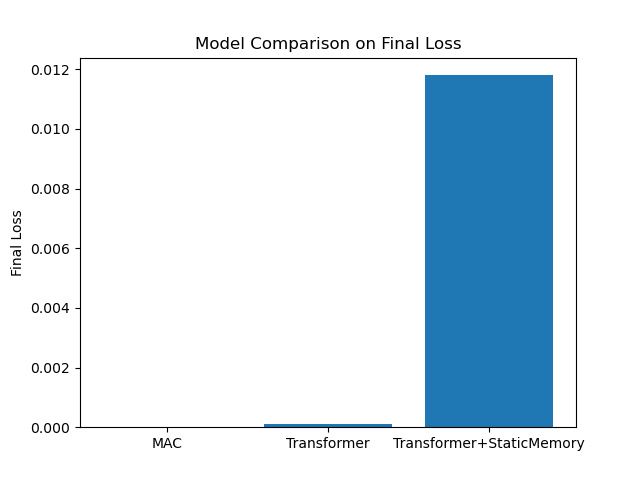

# Titans: Learning to Memorize at Test Time

This repository contains an implementation of the Titans architecture from the paper ["Titans: Learning to Memorize at Test Time"](https://arxiv.org/pdf/2501.00663) by Behrouz et al. (2024). The implementation focuses on the core concepts of the neural memory system which is designed to overcome limitations in how current AI systems handle long-term memory. The system is loosely inspired by the human memory system, and is designed to be flexible enough to learn and adapt during inference.

## Contents
- [Components](#components)
- [Implementation Details](#implementation-details)
- [Deviations from Paper](#deviations-from-paper)
- [Results](#results)
- [Areas for Extension](#areas-for-extension)

## Components

1. **Neural Memory** (`neural_memory.py`)
   - Implements gradient-based learning via surprise with momentum
   - Supports deep memory networks (configurable layers)
   - Includes forgetting mechanism via weight decay

2. **Full Architecture** (`architecture.py`)
   - **MAC (Memory as Context)**: Concatenates retrieved memory with current context
   - I tried to keep this as faithful to the paper as possible.
   - With more time, I would also like to implement the other two architectures in the paper.

3. **Tests** (`tests` folder)
   - I tested the capacity of the neural memory system by testing how many sequences of random numbers it can memorise. This test can be found in `capacity.py`.
   - I also tested how the model handles sequences of different lengths. This test can be found in `length_test.py`.
   - I compared with some baselines in the `model_comparison.py` script. See the [Results](#results) section for the results of all tests.
   - You can run these tests yourself; this is probably the best way to interact with this repository.

## Implementation Details

### Memory Update Mechanism

```python
# Core update equation
S_t = η_t * S_{t-1} - θ_t * ∇L(M_{t-1}, x_t)  # Surprise with momentum
M_t = (1 - α_t) * M_{t-1} + S_t              # Memory update with forgetting
```

Where:
- `S_t`: Surprise state at time t
- `M_t`: Memory parameters at time t
- `η_t`: Surprise decay factor
- `θ_t`: Learning rate
- `α_t`: Forgetting gate

In the paper, the decay factor, learning rate and forgetting gate are all data-dependent but I simplified this implementation by fixing them.

### Key Features

- **Surprise-based Learning**: Prioritises memorisation of unexpected patterns
- **Momentum in Surprise**: Maintains memory of surprising events across time
- **Adaptive Forgetting**: Data-dependent gating for memory management
- **Deep Memory Networks**: Multi-layer MLPs for flexible memory storage

## Deviations from Paper

1. **Parallelisation Strategy**
   - **Paper**: They implement parallel training using tensorised mini-batch gradient descent
   - **Here**: Sequential processing without parallel optimisation
   - **Impact**: Reduced efficiency for very long sequences (this becomes an issue when trying to determine the limits of the memory capacity and sequence length handling)

2. **Linear transformations of input**
   - **Paper**: They do not say how to set the $W_K$ and $W_V$ matrices that transform the input tokens into keys and values for memorisation. 
   - **Here**: They *do* say that these weights are not learned in the inner memorisation loop, so I fixed them here for this proof-of-concept implementation.

3. **Parameter Dependencies**
   - **Paper**: Allows chunk-level parameters for efficiency
   - **Here**: Strictly token-level parameters (also, as aforementioned, these are actually set as constants)
   - **Impact**: Higher computational cost but finer granularity

4. **Multi-layer MLPs**
   - **Paper**: They use MLPs with at least 2 layers.
   - **Here**: My implementation is flexible, but in the tests I ran, I set the number of layers to 1 for simplicity. This kept things simpler and reduced training time.
   - **Impact**: With more layers, it stands to reason that one could memorise more information. 

There are other more minor simplifications/assumptions made throughout the code where the paper was unclear or some complexity was not needed to reproduce the fundamental concepts in the paper. Here I have listed the ones that are worth noting.


## Results

I focused on three main tests in this comparison. I would like to come back and do further testing, as discussed below, but for now the following are implemented:
- Testing the capacity of the MAC Titan
- Testing its ability to memorise longer sequences
- Comparing MAC with two baselines:
   - A standard transformer with windowed processing
   - Another transformer with static memory tokens. This mimics the persistent memory proposed in Titans.

### Testing capacity and sequence lengths

The basis for all my tests was memorising sequences of random numbers. Unfortunately, it seems like this was too 'easy' of a memorisation task so it was difficult to ascertain the capacity of the MAC architecture, even with just one MLP layer. I increased the dataset size in powers of 2, and was able to perfectly memorise $2^{17} = 131072$ sequences. Trying to memorise larger datasets is slow with the current non-parallelised training architecture, running on a CPU-only version of PyTorch. I would like to continue the capacity exploration with a properly parallelised training setup. 

One interesting analysis that naturally follows from this would be to plot the capacity of different neural memory MLPs against their parameter count. This could be compared against some theoretical results. Another interesting dimension to this problem is the variance of the dataset. If, for example, we used a massive dataset where all the data lie along a single principal component, the storage requirements may actually be lower than a smaller, high-dimensional dataset.

Similarly, the MAC model had no issues memorising fairly long sequences of $16384$ tokens, and testing on longer sequences is currently slow. However, even getting this level of performance from a basic proof-of-concept implementation seems promising.

### Model comparison



Here we see the average MSE over 2 trials for each model. The task here was to memorise 128 random sequences, each of length 16. We see that the MAC achieves perfect performance on this task, with the standard transformer achieving final loss of $10^{-4}$. Meanwhile, the transformer with static memory tokens does not seem to have converged, with average MSE of 0.0118. This is also reflected in its poorer recall performance. This can be seen the `model_comparison_results.csv` file provided. Again, I think it is worth noting that we could get more robust results with a more difficult task, and this is something I would like to improve in the future.


## Areas for Extension


### Parallelisation Implementation
- Implement the parallel training algorithm from Section 3.2
- This would involve: 
  - Tensorise gradient computations across chunks
  - Implement parallel associative scan for momentum
  - Add chunk-level parameter options

### Advanced Memory Architectures
- We could try to replace the simple MLPs implemented here with specialised memory networks
- For example:
  - Hopfield networks for associative memory
  - Graph neural networks for relational memory

### Other Titans architectures
- An obvious thing to do would be to add the other architectures that were proposed in the paper: Memory as a Gate and Memory as a Layer.
- I chose to stick with this implementation because it performed the best and conceptually the other two are not that dissimilar.

### Comparison with other models or information retrieval systems
- By far the most widely used system for retrieving information at test time is RAG (Retrieval Augmented Generation).
- This neural memory method has clear advantages over RAG in terms of flexibility to adapt to and store new information at test time.
- It could still be interesting to understand when to use Titans vs RAG with a set of tests that vary the novelty of information given at test time.
- There also exist a whole host of other baselines we could compare Titans against. A complete evaluation of this paper would include large-scale benchmarking against current state-of-the-art methods in LLM memory systems.

### Different datasets for testing
- This method seems well-suited to memorising and retrieving natural language information, so by limiting ourselves to sequences of random numbers, we are not really exploiting its full power. This limitation also weakened some of the testing I did, as discussed above.
- We could extend this work by trying to memorise large corpuses of unseen information.
- This would require finding large corpuses of text that an LLM has definitely *not* seen during its training, which may not be straightforward.
- We could make the problem harder by testing needle-in-a-haystack scenarios with datasets that include lots of distractors, or by testing memory over extremely long contexts.

### Sensitivity Analysis
- We could test robustness by investigating how retrieval performance is affected by adding noise to queries.
- Another type of robustness we could test is resistance to adversarial patterns, that is, pieces of information that are similar but ultimately contradictory.
- It could be interesting in this case to measure any interference between memories.

---

